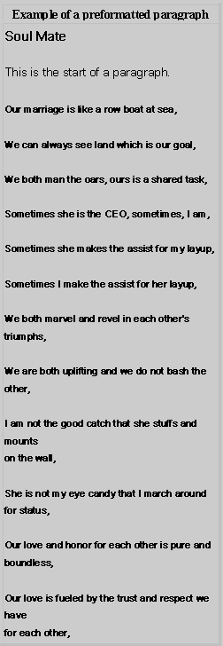



## A tutorial on HTML

### Description

Updated: 10/08/11 to show how to create scripts.

Updated: 9/27/11 to show how to create subscripts and superscripts.

Updated: 9/14/11 to show two ways to create a button.

Updated: 7/18/11 to show

1- What is a Link 	This an example of defining a basic link

2- Local Link 	This is an example of how to display the contents of a disk drive.

3- Target Link 	This is an example of how to display the contents of a web page in a new window.

Updated: 1/16/11 to show

1 The DIV II tutorial shows how create a horizontal and a vertical navigation menu.

2 The DIV III tutorial shows how create a scroll bar.

3 The DIV IV tutorial shows how use the ID attribute.

4 The DIV V tutorial shows how use the CLASS attribute.

Updated: 8/21/10 to show more uses of the table tag, i.e., Multiplication, Addition amd Subtraction Tables. Updated: 4/02/10 to show more uses of the form tag. Updated: 9/17/09 to show the Paragraph, break and Preformat tags. This is a collection of pages that introduce you to HTML. The purpose of the the first page in this tutorial is to show you how to write a Blank page. What is HTML (HyperText Markup Language)? HTML is a layout/tag language that is used to organize text and/or images on a web page. In the following example, we will show you the code

for our blank page. In the following pages, we will explore

1- Comment_and_HR tags

2- Font tag

3- Form tag

4- Headings, Strong and Bold tags

5- HR Example tag

6- OL, UL, DL tags

7- Paragraph tag

8 - Paragraph and break tags

9- Preformat tag

10- Style tag

11- Table tag

12- Subtraction Table

13- Addition Table

14- Multiplication Table
 
### More Info
 

             |
---                |---
**Submitted On**   |2011-10-08 16:24:42
**By**             |[Ronald Holland](https://github.com/Planet-Source-Code/PSCIndex/blob/master/ByAuthor/ronald-holland.md)
**Level**          |Beginner
**User Rating**    |4.4 (31 globes from 7 users)
**Compatibility**  |VB Script
**Category**       |[Internet/ HTML](https://github.com/Planet-Source-Code/PSCIndex/blob/master/ByCategory/internet-html__1-34.md)
**World**          |[Visual Basic](https://github.com/Planet-Source-Code/PSCIndex/blob/master/ByWorld/visual-basic.md)
**Archive File**   |[A\_tutorial2212571082011\.zip](https://github.com/Planet-Source-Code/ronald-holland-a-tutorial-on-html__1-71228/archive/master.zip)

